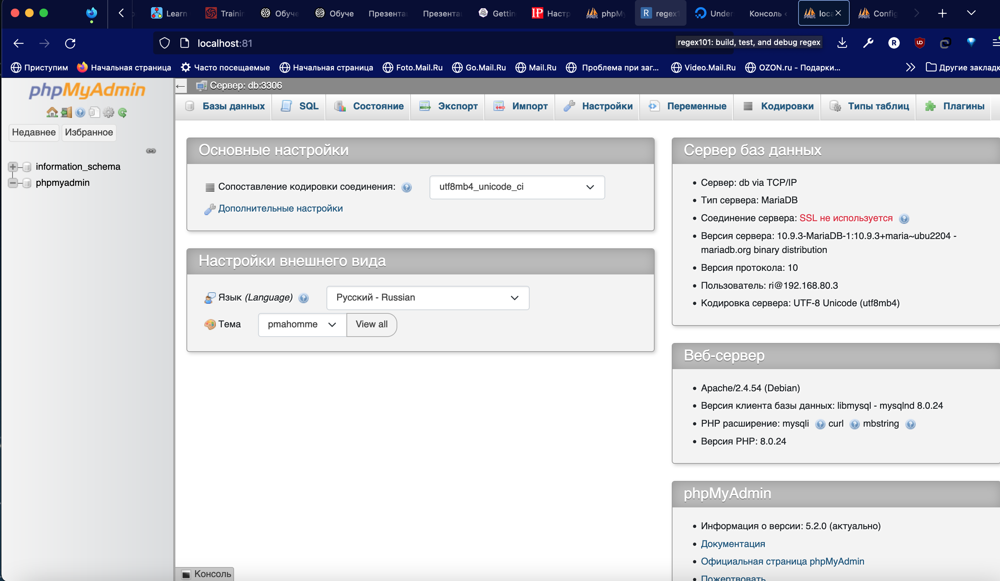
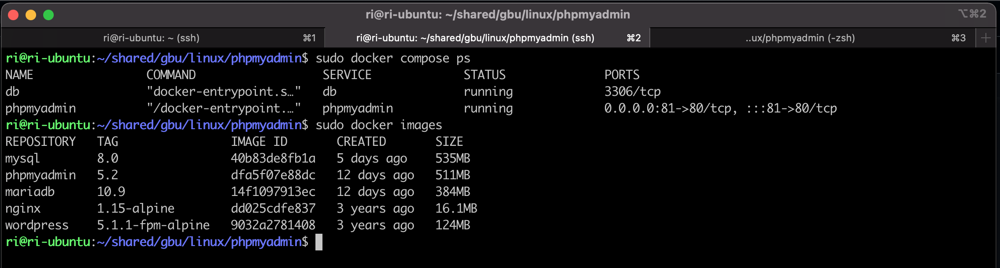

# Урок 7. Запуск веб-приложения из контейнеров

    
##   Задание 2. *Запустить два контейнера, связанные одной сетью (используя документацию). Первый контейнер БД (например, образ mariadb:10.8), второй контейнер — phpmyadmin. Получить доступ к БД в первом контейнере через второй контейнер (веб-интерфейс phpmyadmin).

### Скриншоты работы Phpmyadmin

  

  
